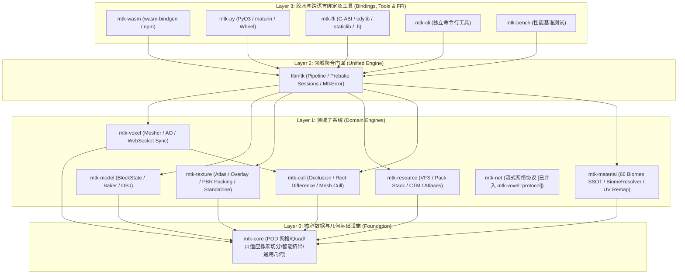

# libmozitoolkit 系统架构设计 (Architecture)

## 1. 架构定位与愿景

`libmozitoolkit` (`libmtk`) 是一个**高性能、无宿主依赖 (Host-Agnostic)、纯数据驱动的通用 3D 与体素 (Voxel) 几何处理内核套件**。

### 设计原则
1. **纯数据流输入输出 (Data-in, Data-out)**：输入原始体素/网格/UV/流数据/PBR贴图，输出扁平化的连续内存网格流（Positions, Normals, UVs, Indices, Material Slots, Custom Attributes）与图集内存。
2. **原子化与高内聚 (Atomic & Modular)**：每个子 crate 职责单一、边界清晰，可独立引用、独立编译。
3. **多端目标与原生跨语言支持**：原生兼容 WebAssembly (WASM)、Python CPython 扩展模块 (Wheel)、以及通用 C-ABI 动态/静态库 (`.so` / `.dll` / `.dylib` / `.h`)。
4. **零宿主耦合与标准 3D 几何规范**：核心层不依赖任何 DCC 软件（如 Blender、Maya）专有 API，标准化坐标系命名（`z_up_coordinates`, `mc_local_to_centered_z_up`, `mc_world_to_z_up`），只在宿主端做数据灌入。
5. **生物群系与调色板单一事实源 (SSOT)**：所有 Biome / 颜色 / Tint 逻辑以 `mtk-material::biome` 为唯一权威事实源，避免多处碎片化定义。

---

## 2. 4 层分层架构拓扑



---

## 3. 各 Crate 职责矩阵

| Crate 路径 | 核心定位 | 依赖上游 | 输出与产物 |
| :--- | :--- | :--- | :--- |
| **`crates/mtk-core`** | 纯净数据底座、POD 顶点/面数据结构、通用数学与几何基元、自适应像素网格切分 (`subdivide`) 与智能挤出/UV 修复 (`extrude`) | 仅依赖 `glam`, `serde` (可选) | `MeshData`, `Quad`, `Aabb2d/3d`, `Direction`, `DirMask`, `ExtrudeMeshOutput`, 像素切分算子 |
| **`crates/mtk-cull`** | 面剔除状态机、2D/3D 矩形差集切分 (Subtract Rect)、外部导入模型面剔除 (`cull_mesh_faces`) | `mtk-core` | `BlockCullMeta`, `FaceCuller`, 裁剪后微矩形列表, `MeshCullResult` |
| **`crates/mtk-model`** | BlockState 状态解析、1.21+ Block Model JSON 烘焙、Wavefront OBJ 解析与导出 | `mtk-core` | `BlockState`, `BlockModelJson`, `BakedModel`, `BakedModelDatabase` |
| **`crates/mtk-texture`**| 空间装箱图集拼接器 (Stitcher)、多类别图集烘焙 (`build_categories`)、Companion Overlay 贴图合成、Standalone 资产层级对齐 | `mtk-core` | `AtlasBuilder`, `BakedAtlas`, `BakedAtlasChunk`, `RgbaBuffer`, UV 坐标映射表 |
| **`crates/mtk-resource`**| 虚拟文件系统 (VFS / Zip / Memory / Dir)、CTM 47/17 连接纹理求解、动画元数据与原版 atlases/*.json 解析 | `mtk-core` | `ResourcePackStack`, `CtmSolver`, `AnimationMetadata`, `AtlasDefinition` |
| **`crates/mtk-voxel`**  | 16x16x16 Chunk Section 体素存储、平滑 AO 计算、网格化器 (Mesher)、二进制小端序协议与原生 WebSocket 实时协同会话 | `mtk-core`, `mtk-cull` | `SectionStorage`, `VoxelStorage`, `SectionMesher`, `DeltaMesher`, `LiveSyncSession`, `WorldMeshBuildResult` |
| **`crates/mtk-material`** | 66 种原版生物群系调色板与线性色彩数学引擎 (SSOT)、`BiomeResolver` 模型扫描与预编译映射、多线程 Rayon 并行 UV 重映射与外部别名解算 | `mtk-core` | `BiomePalette`, `BiomeResolver`, `compute_mesh_biome_attributes`, `MaterialResolver`, `MeshMultiUvRemapResult` |
| **`crates/libmtk`** | 顶层统一 Facade 库，提供开箱即用的高阶预编译管线 (`precompile_all_assets`) 与一站式统一错误处理 `MtkError` | 全部 Layer 1 Crates | 高阶 API、统一 Error 与 Pipeline、`CacheManifest` |
| **`crates/mtk-bench`** | 性能基准测试套件，覆盖 4000 区块大规模网格化与复杂面剔除场景 | 全部核心 Crates | 基准测试报告与性能指标 |
| **`crates/mtk-cli`** | 独立命令行终端工具，为无头环境与 CI/CD 提供资产预编译与检查能力 | `libmtk` | 命令行二进制 `mtk` |
| **`bindings/mtk-py`** | Python 动态扩展模块 (PyO3 + maturin)，提供 `PyMeshData`、零拷贝内存视图与极速批处理算子 | `libmtk`, `mtk-core` | `libmtk_py` CPython 轮子 (.whl) |
| **`bindings/mtk-ffi`** | 纯 C-ABI 动态/静态库与 C 头文件 (cbindgen)，跨语言无缝调用 | `libmtk`, `mtk-core` | `libmtk_ffi.so` / `.dll` / `.dylib`, `mtk.h` |
| **`bindings/mtk-wasm`** | WebAssembly 绑定 (wasm-bindgen)，暴露 TypedArray 视图 | `libmtk`, `mtk-core` | `mtk_wasm.wasm` + `mtk_wasm.js` npm 包 |

---

## 4. 跨端数据交换标准 (Host-Agnostic Protocol)

为了保证高性能与零拷贝，Rust 导出层与宿主层（Python/JS/C#）约定以下**扁平连续内存结构 (Flat Contiguous Buffers)**：

```
Rust 处理内核 (libmtk)
  │
  ├─ 顶点位置流:      [x0, y0, z0, x1, y1, z1, ...]                   -> f32 连续数组
  ├─ 顶点法线流:      [nx0, ny0, nz0, nx1, ny1, nz1, ...]             -> f32 连续数组
  ├─ 纹理 UV 流:      [u0, v0, u1, v1, ...]                           -> f32 连续数组
  ├─ 备用/局部 UV 流:  [u0, v0, u1, v1, ...] (可选)                    -> f32 连续数组
  ├─ 顶点颜色/Tint:   [r0, g0, b0, a0, ...] (Packed / Linear)          -> f32 连续数组
  ├─ 三角形/多边形索引: [i0, i1, i2, i3, i4, i5, ...]                   -> u32 连续数组
  ├─ 面拓扑循环范围:  [len0, len1, len2, ...] (保留 Quad/N-gon)         -> u32 连续数组
  ├─ 材质插槽映射:    [mat_id_0, mat_id_1, ...]                       -> u32 连续数组
  ├─ 自定义属性图层:  Weights / Bone / Crease / Layer (按需双线性插值)   -> f32 连续数组
  └─ 贴图数据流:      [r, g, b, a, r, g, b, a, ...]                   -> u8 连续像素内存
```

宿主端通过指针与长度（或 Python Buffer Protocol `memoryview` / JS `TypedArray`）直接读取，并在宿主内部调用专有场景 API 批量构建，杜绝逐元素低效循环。
