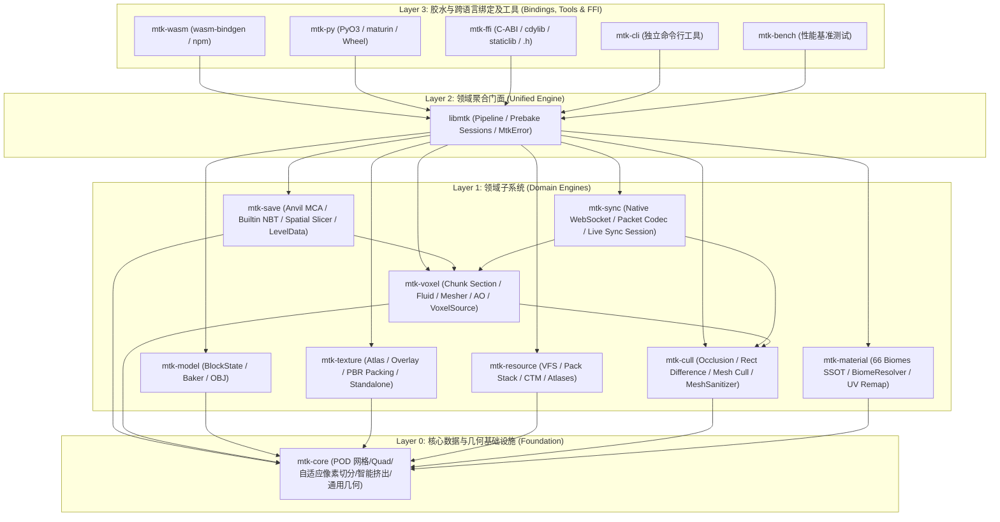

# libmozitoolkit 系统架构设计 (Architecture)

## 1. 架构定位与愿景

`libmozitoolkit` (`libmtk`) 是一个**高性能、无宿主依赖 (Host-Agnostic)、纯数据驱动的通用 3D 与体素 (Voxel) 几何处理内核套件**。

### 设计原则
1. **纯数据流输入输出 (Data-in, Data-out)**：输入原始体素/网格/UV/流数据/PBR贴图，输出扁平化的连续内存网格流（Positions, Normals, UVs, Indices, Material Slots, Custom Attributes）与图集内存。
2. **原子化与高内聚 (Atomic & Modular)**：每个子 crate 职责单一、边界清晰，可独立引用、独立编译。
3. **多端目标与原生跨语言支持**：原生兼容 WebAssembly (WASM)、Python CPython 扩展模块 (Wheel)、以及通用 C-ABI 动态/静态库 (`.so` / `.dll` / `.dylib` / `.h`)。
4. **零宿主耦合与标准 3D 几何规范**：核心层不依赖任何 DCC 软件（如 Blender、Maya）专有 API，标准化坐标系命名（`z_up_coordinates`, `mc_local_to_centered_z_up`, `mc_world_to_z_up`），只在宿主端做数据灌入。
5. **生物群系与调色板单一事实源 (SSOT)**：所有 Biome / 颜色 / Tint 逻辑以 `mtk-material::biome` 为唯一权威事实源，避免多处碎片化定义。

---

## 2. 4 层分层架构拓扑


```mermaid
graph TD
    subgraph Layer3_Bindings["Layer 3: 胶水与跨语言绑定及工具 (Bindings, Tools & FFI)"]
        WASM["mtk-wasm (wasm-bindgen / npm)"]
        PY["mtk-py (PyO3 / maturin / Wheel)"]
        FFI["mtk-ffi (C-ABI / cdylib / staticlib / .h)"]
        CLI["mtk-cli (独立命令行工具)"]
        BENCH["mtk-bench (性能基准测试)"]
    end

    subgraph Layer2_Facade["Layer 2: 领域聚合门面 (Unified Engine)"]
        LIBMTK["libmtk (Pipeline / Prebake Sessions / MtkError)"]
    end

    subgraph Layer1_Domain["Layer 1: 领域子系统 (Domain Engines)"]
        VOXEL["mtk-voxel (Chunk Section / Fluid / Mesher / AO / VoxelSource)"]
        SYNC["mtk-sync (Native WebSocket / Packet Codec / Live Sync Session)"]
        MODEL["mtk-model (BlockState / Baker / OBJ)"]
        TEXTURE["mtk-texture (Atlas / Overlay / PBR Packing / Standalone)"]
        RESOURCE["mtk-resource (VFS / Pack Stack / CTM / Atlases)"]
        CULL["mtk-cull (Occlusion / Rect Difference / Mesh Cull / MeshSanitizer)"]
        MAT["mtk-material (66 Biomes SSOT / BiomeResolver / UV Remap)"]
        SAVE["mtk-save (Anvil MCA / Builtin NBT / Spatial Slicer / LevelData)"]
    end

    subgraph Layer0_Core["Layer 0: 核心数据与几何基础设施 (Foundation)"]
        CORE["mtk-core (POD 网格/Quad/自适应像素切分/智能挤出/通用几何)"]
    end

    WASM --> LIBMTK
    PY --> LIBMTK
    FFI --> LIBMTK
    CLI --> LIBMTK
    BENCH --> LIBMTK

    LIBMTK --> VOXEL
    LIBMTK --> SYNC
    LIBMTK --> MODEL
    LIBMTK --> TEXTURE
    LIBMTK --> RESOURCE
    LIBMTK --> CULL
    LIBMTK --> MAT
    LIBMTK --> SAVE

    SAVE --> VOXEL
    SAVE --> CORE

    SYNC --> VOXEL
    SYNC --> CULL
    VOXEL --> CORE
    VOXEL --> CULL
    MODEL --> CORE
    TEXTURE --> CORE
    RESOURCE --> CORE
    CULL --> CORE
    MAT --> CORE
```

---

## 3. 各 Crate 职责矩阵

| Crate 路径 | 核心定位 | 依赖上游 | 输出与产物 |
| :--- | :--- | :--- | :--- |
| **`crates/mtk-core`** | 纯净数据底座、POD 顶点/面数据结构、通用数学与几何基元、自适应像素网格切分 (`subdivide`) 与智能挤出/UV 修复 (`extrude`) | 仅依赖 `glam`, `serde` (可选) | `MeshData`, `Quad`, `Aabb2d/3d`, `Direction`, `DirMask`, `ExtrudeMeshOutput`, 像素切分算子 |
| **`crates/mtk-cull`** | 面剔除状态机、2D/3D 矩形差集切分 (Subtract Rect)、统一网格清理工具门面 (`MeshSanitizer`)、外部导入模型面剔除 (`cull_mesh_faces`) | `mtk-core` | `BlockCullMeta`, `FaceCuller`, `MeshSanitizer`, 裁剪后微矩形列表, `MeshCullResult` |
| **`crates/mtk-model`** | BlockState 状态解析、1.21+ Block Model JSON 烘焙、Wavefront OBJ 解析与导出 | `mtk-core` | `BlockState`, `BlockModelJson`, `BakedModel`, `BakedModelDatabase` |
| **`crates/mtk-texture`**| 空间装箱图集拼接器 (Stitcher)、多类别图集烘焙 (`build_categories`)、Companion Overlay 贴图合成、Standalone 资产层级对齐 | `mtk-core` | `AtlasBuilder`, `BakedAtlas`, `BakedAtlasChunk`, `RgbaBuffer`, UV 坐标映射表 |
| **`crates/mtk-voxel`**  | 纯体素核心：16x16x16 Chunk Section 体素存储、全量无剔除体素点云 (`VoxelPointCloud`)、平滑 AO 计算、网格化器 (Mesher)、物理流体曲面、统一体素源抽象 (`VoxelSource` / `VoxelReader` / `VoxelWriter`) | `mtk-core`, `mtk-cull`, `mtk-model`, `mtk-texture`, `mtk-resource`, `mtk-material` | `SectionStorage`, `VoxelStorage`, `VoxelPointCloud`, `SectionMesher`, `DeltaMesher`, `VoxelSource`, `WorldMeshBuildResult` |
| **`crates/mtk-sync`**   | 实时网络协同：原生多线程 WebSocket 客户端、小端序二进制协议编解码、增量修复包生成、复合模型库注入与单一世界大网格 (`WorldMeshReady`) 会话管理 | `mtk-voxel`, `mtk-cull`, `mtk-model`, `mtk-core` | `LiveSyncSession`, `SyncClient`, `SyncEvent`, `decode_packet`, `encode_full_sync_request` |
| **`crates/mtk-material`** | 66 种原版生物群系调色板与线性色彩数学引擎 (SSOT)、`BiomeResolver` 模型扫描与预编译映射、多线程 Rayon 并行 UV 重映射与外部别名解算 | `mtk-core` | `BiomePalette`, `BiomeResolver`, `compute_mesh_biome_attributes`, `MaterialResolver`, `MeshMultiUvRemapResult` |
| **`crates/mtk-save`** | 现代 Minecraft 存档加载核心：基于内置零拷贝 NBT、Anvil `.mca` 区域文件寻址、384 高度世界 3D 生物群系与方块状态解包、按需空间切片流式数据源 (`VoxelSource`) | `mtk-core`, `mtk-voxel` | `LevelData`, `RegionFile`, `ChunkParser`, `AnvilWorldSource`, `SaveLoader` |
| **`crates/libmtk`** | 顶层统一 Facade 库，提供开箱即用的高阶预编译管线 (`precompile_all_assets`) 与一站式统一错误处理 `MtkError` | 全部 Layer 1 Crates | 高阶 API、统一 Error 与 Pipeline、`CacheManifest` |
| **`crates/mtk-bench`** | 性能基准测试套件，覆盖 4000 区块大规模网格化与复杂面剔除场景 | 全部核心 Crates | 基准测试报告与性能指标 |
| **`crates/mtk-cli`** | 独立命令行终端工具，为无头环境与 CI/CD 提供资产预编译与检查能力 | `libmtk` | 命令行二进制 `mtk` |
| **`crates/mtk-testkit`** | **仅测试用**（`publish = false`）资产解析器与内置 JSON fixtures：统一真包位置发现、缺省跳过策略与路径拼接 | 仅 `std` | `assets_root`, `real_assets_root`, `fabric_jar`, `model_json_path`, fixtures |
| **`bindings/mtk-py`** | Python 动态扩展模块 (PyO3 + maturin)，提供 `PyMeshData`、零拷贝内存视图与极速批处理算子 | `libmtk`, `mtk-core` | `libmtk_py` CPython 轮子 (.whl) |
| **`bindings/mtk-ffi`** | 纯 C-ABI 动态/静态库与 C 头文件 (cbindgen)，跨语言无缝调用 | `libmtk`, `mtk-core` | `libmtk_ffi.so` / `.dll` / `.dylib`, `mtk.h` |
| **`bindings/mtk-wasm`** | WebAssembly 绑定 (wasm-bindgen)，暴露 TypedArray 视图 | `libmtk`, `mtk-core` | `mtk_wasm.wasm` + `mtk_wasm.js` npm 包 |

---

## 4. 跨端数据交换标准 (Host-Agnostic Protocol)

为了保证高性能与零拷贝，Rust 导出层与宿主层（Python/JS/C#）约定以下**扁平连续内存结构 (Flat Contiguous Buffers)**：

```
Rust 处理内核 (libmtk)
  │
  ├─ 顶点位置流:      [x0, y0, z0, x1, y1, z1, ...]                   -> f32 连续数组
  ├─ 顶点法线流:      [nx0, ny0, nz0, nx1, ny1, nz1, ...]             -> f32 连续数组
  ├─ 纹理 UV 流:      [u0, v0, u1, v1, ...]                           -> f32 连续数组
  ├─ 备用/局部 UV 流:  [u0, v0, u1, v1, ...] (可选)                    -> f32 连续数组
  ├─ 顶点颜色/Tint:   [r0, g0, b0, a0, ...] (Packed / Linear)          -> f32 连续数组
  ├─ 三角形/多边形索引: [i0, i1, i2, i3, i4, i5, ...]                   -> u32 连续数组
  ├─ 面拓扑循环范围:  [len0, len1, len2, ...] (保留 Quad/N-gon)         -> u32 连续数组
  ├─ 材质插槽映射:    [mat_id_0, mat_id_1, ...]                       -> u32 连续数组
  ├─ 自定义属性图层:  Weights / Bone / Crease / Layer (按需双线性插值)   -> f32 连续数组
  └─ 贴图数据流:      [r, g, b, a, r, g, b, a, ...]                   -> u8 连续像素内存
```

宿主端通过指针与长度（或 Python Buffer Protocol `memoryview` / JS `TypedArray`）直接读取，并在宿主内部调用专有场景 API 批量构建，杜绝逐元素低效循环。

---

## 5. 内部模块化解耦与文件组织规范 (Modularization Standards)

为保持超高内聚性、可维护性并防止单文件膨胀（原则上所有源码文件控制在 300~500 行以内），`libmtk` 对大型复合模块进行了结构性子模块拆分：

### 5.1 核心拆分拓扑
- **`mtk-core::subdivide`**:
  - `clip.rs`: 多边形凸裁剪与 Sutherland-Hodgman 2D 拓扑切分
  - `grid.rs`: 目标细分分辨率推算与整数像素网格切割因子吸附计算
  - `mesh_split.rs`: 单面多边形切割与全网格自适应细分装配
  - `mod.rs`: 门面导出与统一测试套件
- **`mtk-core::extrude_mesh`**:
  - `types.rs`: 扁平拓扑网格与挤出修复配置
  - `repair.rs`: 侧面 UV 修复核心计算与法线重构
  - `random.rs`: 伪随机/梯度噪声挤出算子
  - `mod.rs`: 门面重导出与集成测试
- **`mtk-cull::rules::categories`**:
  - `catalog.rs`: 原版及常见方块剔除类型常数字典与快速查表
  - `parametric.rs`: 基于方块状态参数（如阶梯半高、朝向）的动态元数据生成
  - `meta.rs`: `BlockCullMeta` 核心定义与方向遮挡掩码判定
  - `mod.rs`: 模块门面重导出
- **`mtk-model::baker::baked_model`**:
  - `model.rs`: 烘焙方块模型核心基元与变换矩阵
  - `database.rs`: 烘焙模型数据库与状态键索引
  - `to_mesh.rs`: 烘焙模型向通用 `MeshData` 的快速灌入与拓扑转换
  - `legacy.rs`: 旧版原版模型兼容格式解析
  - `mod.rs`: 门面重导出与集成测试
- **`mtk-model::parser::blockstate`**:
  - `definition.rs`: Blockstate JSON 顶层 AST 定义与反序列化
  - `state.rs`: 变体键解析与状态属性匹配器
  - `resolver.rs`: 复杂多状态条件解析引擎与烘焙模型关联
  - `mod.rs`: 门面重导出与测试
- **`mtk-voxel::storage::world`**:
  - `container.rs`: 区块 Section 容器存储与三维坐标索引
  - `snapshot.rs`: 世界切片快照与动态边界提取
  - `manifest.rs`: 变更清单与 CRC 校验
  - `padded.rs`: 邻域填充数组与边界平滑支持
  - `mod.rs`: 模块统一门面重导出
- **`mtk-sync::session`**:
  - `dispatcher.rs`: 网络协议数据包分发器与处理流水线
  - `mod.rs`: `LiveSyncSession` 会话状态机与生命周期管理
- **`mtk-texture::atlas::builder`**:
  - `static_atlas.rs`: 静态纹理装箱与多通道 PBR 图集烘焙
  - `anim_atlas.rs`: 动画条图集处理与帧元数据对齐
  - `paletted.rs`: 调色板置换贴图预烘焙
  - `types.rs`: 图集块构建器配置与中间数据结构
  - `mod.rs`: 门面统一聚合与去重封装
- **`mtk-material::biome::resolver`**:
  - `types.rs`: Biome 解析器配置与别名数据结构
  - `lookup.rs`: 快速别名查询与材质匹配
  - `scanner.rs`: 模型顶点色与生物群系 Tint 扫描器
  - `defaults.rs`: 原版默认生物群系回退规则
  - `mod.rs`: 门面重导出
- **`mtk-py::attributes`**:
  - Python Buffer Protocol 零拷贝统一解码器与 DCC 属性域映射

所有拆分严格遵循 **零破坏性（Zero Breaking Changes）** 准则，公共 API、函数签名与符号重导出保持 100% 向后兼容。
